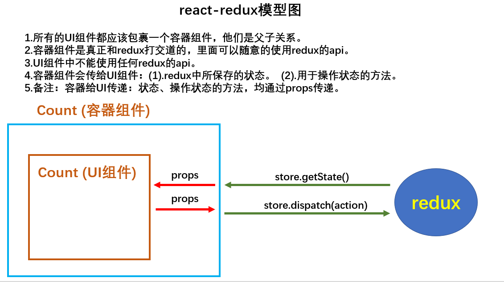

# React学习笔记

## React简介

* 用于构建用户界面的javaScript库
* 是一个将数据渲染为HTML视图的开源JavaScript库

### 为什么要用react

* 原生JavaScript操作DOM繁琐、效率低（DOM-API操作UI）
* 使用JavaScript直接操作DOM，浏览器会进行大量的重绘重排
* 原生JavaScript没有组件化编码方案，代码复用率低

### React的特点

* 采用组件化模式、声明式编码，提高开发效率及组件复用率
* 在React Native中可以使用React语法进行移动端开发
* 使用虚拟DOM+优秀的Diffing算法，尽量减少与真实DOM的交互
* 笔记：https://github.com/TaoLoading/01-WebStudy/blob/master/18-React

## 工具

* React Developer Tools
  * 安装：谷歌浏览器 --> 扩展程序 --> 访问chrome应用商店 --> 搜索React Developer Tools --> 添加到扩展程序
  * 使用：开发者模式 --> Components（查看react组件）和Profiler（记录网站的性能）
* Redux DevTools
  * 安装：谷歌浏览器 --> 扩展程序 --> 访问chrome应用商店 --> 搜索Redux DevTools --> 添加到扩展程序
  * 使用：开发者模式 --> Redux DevTools


## 虚拟DOM

虚拟DOM是一种轻量级的JavaScript对象，它是真实DOM的一种抽象表示。虚拟DOM的主要优点包括：

* **提高性能**：通过比较虚拟DOM的变化，减少对实际DOM的操作，从而提高应用性能。
* **跨平台**：虚拟DOM可以用于不同的渲染目标，如浏览器、服务器或原生应用。
* **简化开发**：框架可以自动管理DOM更新，开发者只需关注数据变化。

虚拟DOM的工作流程通常包括以下几个步骤：

* **创建**：根据组件的状态创建虚拟DOM树。
* **比较**：当状态发生变化时，生成新的虚拟DOM树，并与之前的虚拟DOM树进行比较，找出差异。
* **更新**：将差异应用到真实的DOM上，实现界面的更新。

## react脚手架

* 脚手架：用来帮助我们快速创建一个基于xxx库的模板项目
  * 包含了项目所需的webpack配置、react配置、路由配置、jsx解析器等
  * 下载好了所有相关的依赖
  * 可以直接运行
* 常用的库：Vue-cli、Create React App（react脚手架）
* 项目的整体技术架构为: react + webpack + es6 + eslint
* 使用脚手架开发的项目的特点:
  * 模块化(js、css)
  * 组件化
  * 工程化

## 创建项目并启动

* 全局安装create-react-app
  * npm i -g create-react-app
* 切换到想创建项目的目录,创建项目
  * create-react-app react_staging
* 进入项目文件夹,启动项目
  * cd react_staging
  * npm start
* 可以通过以下步骤指定react版本
  * 打开 package.json 文件，找到 dependencies 部分，将 react 和 react-dom 的版本修改为 "18.3.1"，例如：
    ```json
    "dependencies": {
      "react": "18.3.1",
      "react-dom": "18.3.1",
      // 其他依赖...
    }
    ```
  * 保存文件后，删除 node_modules 文件夹
  * 重新安装依赖
    * npm i
* 如果运行项目报以下错误
  * 错误信息：
    * Module not found: Error: Can't resolve 'web-vitals' in 'D:\ckc\note\reactNote\react_staging\src'
      ERROR in ./src/reportWebVitals.js 5:4-24
  * 解决方案：
    * npm i web-vitals
    * 重新启动项目
* 访问项目
  * http://localhost:3000/

## react脚手架的项目结构

* public：静态资源文件夹
* src：源码文件夹
* package.json：存储项目名称、版本、描述等配置
* README.md：项目的说明文档，markdown格式

## react插件

* ES7+ React/Redux/React-Native snippets
  * 快速生成react代码
  * 输入rcc 创建一个类组件模板
  * 输入rfc 创建一个函数组件模板

## 组件化编码流程

* 拆分组件：拆分界面，抽取组件，组件命名
* 实现静态组件：使用组件实现静态页面效果
* 实现动态组件
  * 动态显示初始化数据
    * 数据类型
    * 数据名称
    * 保存在哪个组件？
  * 交互：事件的处理

## 请求服务器相关

* 启动测试代理
  ```cmd
  node server.js
  ```

## SPA单页应用（Single Page Application）

* 整个应用只有一个页面
* 点击页面中的链接（路由切换）不会刷新页面，只会局部更新页面
* 数据都需要通过ajax请求获取，并渲染到页面中

## React路由

* 路由：将url映射到UI组件
* Hash路由(HashRouter)
  * 地址中带#号，例如：http://localhost:3000/#/home
  * 实现机制：当URL中的 # 后面的部分发生变化时，浏览器不会向服务器发送请求，而是触发 hashchange 事件。React Router 监听这个事件并更新页面内容。
  * 优点：
    * 简单易用：不需要服务器端配置，适用于静态网站。
    * 兼容性好：支持所有浏览器。
  * 缺点：
    * SEO 不友好：因为 URL 中包含 #，所以无法被搜索引擎收录。
    * URL 不美观：因为 URL 中包含 #，所以 URL 不美观。
* History路由(BrowserRouter)
  * 地址中不带#号，例如：http://localhost:3000/home
  * 实现机制：
    * 当用户点击链接时，React Router 会拦截事件，然后使用 history.pushState 或 history.replaceState 方法来修改URL并更新浏览器的历史记录
    * 监听到路由变化时，React Router 会找到当前路由对应的组件。
    * 然后调用组件的 componentDidMount 或 componentWillReceiveProps 方法，并更新页面内容。
  * 优点：
    * SEO 友好：因为 URL 中不包含 #，所以可以被搜索引擎收录，有利于SEO优化。
    * URL 美观：因为 URL 中不包含 #，所以 URL 更美观。
  * 缺点：
    * 需要服务器端配置：为了确保刷新页面或直接访问某个路由时，服务器能够正确返回应用的HTML文件，需要进行相应的服务器端配置。
    * 不支持IE9及以下版本：因为 History 路由需要使用 HTML5 的 history API，而IE9及以下版本不支持该API。
  * 如果你选择使用History路由，需要在服务器端进行相应的配置。以下是一些常见服务器的配置示例：
    * Nginx：
      ```nginx
        server {
          listen 80;
          server_name example.com;

          location / {
            try_files $uri $uri/ /index.html;
          }
        }
      ```
    * Apache：
      ```apache
        <IfModule mod_rewrite.c>
        RewriteEngine On
        RewriteBase /
        RewriteRule ^index\.html$ - [L]
        RewriteCond %{REQUEST_FILENAME} !-f
        RewriteCond %{REQUEST_FILENAME} !-d
        RewriteRule . /index.html [L]
        </IfModule>
      ```
    * Node.js (Express)：
      ```javascript
        const express = require('express');
        const path = require('path');
        const app = express();

        app.use(express.static(path.join(__dirname, 'build')));

        app.get('*', (req, res) => {
          res.sendFile(path.join(__dirname, 'build', 'index.html'));
        });

        app.listen(3000);
      ```
* HashRouter 和 BrowserRouter 的区别：
  * 底层实现方式不同：
    * HashRouter 使用 URL 的 hash 部分作为路由标识。
    * BrowserRouter 使用 HTML5 的 history API，不兼容IE9及以下版本。
  * url 的格式不同：
    * HashRouter 的url包含#，例如：http://localhost:3000/#/home。
    * BrowserRouter 的url不包含#，例如：http://localhost:3000/home。
  * 刷新后对路由state参数的影响：
    * HashRouter 在刷新页面后，路由state参数会丢失。
    * BrowserRouter 在刷新页面后，路由state参数不会丢失，因为路由组件的state参数是保存在浏览器的history对象中的。

* 向路由组件传递参数
  * 传递param参数
    * 在Link中携带参数：
      ```jsx
        <Link to={`/detail/${item.id}`}>查看</Link>
      ```
    * 在Route中声明参数：
      ```jsx
        <Route path="/detail/:id" component={Detail} />
      ```
    * 在路由组件中接收参数：
      ```jsx
        const { id } = this.props.match.params;
      ```
  * 传递search(query)参数
    * 在Link中携带参数：
      ```jsx
        <Link to={`/detail?id=${item.id}`}>查看</Link>
      ```
      或者
      ```jsx
        <Link to={{ pathname: '/detail', search: `?id=${item.id}` }}>查看</Link>
      ```
    * 无需声明参数
    * 在路由组件中接收参数：
      ```jsx
        const query = new URLSearchParams(this.props.location.search);
        const id = query.get('id');
      ```
      或者
      ```jsx
        import qs from 'qs';
        const { content } = qs.parse(this.props.location.search, { ignoreQueryPrefix: true });
      ```
  * 传递state参数
    * 该方式不会将参数添加（显示）到URL中。但会将传递的state参数保存在组件的props.location.state和history.location.state中
    * state参数默认为undefined
    * 由于BrowserRouter操作的是history对象，所以state参数也会保存到浏览器的history对象中，在页面刷新后并不会丢失，页面的状态也会保存下来。但如果浏览器关闭或者清空缓存，则state参数会丢失。
    * 由于以上原因，读取state参数时，一般要判空并默认返回一个空对象。否则可能会报错
    * 在Link中携带参数：
      ```jsx
        <Link to={{ pathname: '/detail', state: { id: item.id } }}>查看</Link>
      ```
    * 无需声明参数
    * 在路由组件中接收参数：
      ```jsx
        const state = this.props.location.state || {};
        const id = state.id || '';
      ```

## 解决Git总是提示”您确定要继续连接吗（yes/no）
* 在.ssh目录下创建config文件
  ```bash
    nano config
  ```
* 输入以下内容
  ```plaintext
    Host github.com
      StrictHostKeyChecking no
      UserKnownHostsFile /dev/null
  ```
* 保存退出
  * 按 Ctrl + O 保存文件
  * 按 Enter 确认文件
  * 按 Ctrl + X 退出编辑模式

## redux
* redux是什么？
  * redux是一个状态管理库，用于管理应用中的状态。（不是react的库）
  * 它可以用在React、Vue、Angular等框架中，但基本与react配合使用。
  * 可以集中管理react应用中多个组件共享的状态。
* 什么情况下需要使用redux
  * 共享：某个组件的状态，需要给其他组件使用时。
  * 通信：当某个组件的属性发生变化时，需要通知其他组件更新时。
  * 状态管理：当应用状态复杂时，需要使用redux进行状态管理。
  * 总体原则：能不用就不用。
* 学习文档
  * 英文文档：https://redux.js.org/
  * 中文文档：https://www.redux.org.cn/
  * GitHub：https://github.com/reduxjs/redux
* redux的三个核心概念
  * 原理图
    
  * action
    * 动作的对象
    * 包含2个属性
      * type：动作类型，字符串，唯一，必要属性
      * data：动作携带的数据，任意类型，可选属性
    * 例子：{type:'ADD_STUDENT',data:{name:'张三',age:18}}
  * reducer
    * 纯函数
    * 用于初始化状态、修改状态
    * 接收两个参数
      * state：当前状态，默认值是undefined
      * action：动作对象
    * 返回值：新的状态
  * store
    * 将state、action、reducer联系在一起的对象
    * 如何得到此对象
      ```javascript
        import {createStore} from 'redux'
        import reducer from './reducer'
        const store = createStore(reducer)
      ```
    * 此对象的功能
      * getState：得到state状态
      * dispatch：发送一个action，触发reducer调用，产生新的state
      * subscribe：监听state值的变化，一旦变化，就调用回调函数
* 安装redux
  ```bash
    npm install redux
    npm i @reduxjs/toolkit
  ```
* react-redux模型图
  

## 纯函数
* 概念：
  * 函数式编程：把函数当做参数传递、返回函数、函数内部有return语句，都是函数式编程。
  * 纯函数：函数式编程中的一种函数，它的执行结果 solely（ solely：完全）依赖它的参数，而且没有任何副作用。
    * 不能修改传入参数，不能有随机性，不能有外部变量的引用，不能有外部函数的调用。
    * 不能有定时器、ajax请求、console.log、setTimeout等函数调用。
    * 每次输入相同参数必须得到相同结果。
* 为什么不用push，shift，unshift等方法？而是用slice，concat,[...perState,data]等方式
  * 因为它们是修改原数组，自动渲染页面用的是浅比较，由于原state的引用地址未发生变化，所以无法触发组件的更新。
  * 纯函数返回新数组，会触发组件的更新。
* redux的reducer函数必须是纯函数。

## 错误边界ErrorBoundary
* 把错误限制在组件内部，避免整个应用崩溃。
* 用于捕获后代组件生命周期产生的错误，渲染出备用UI。

## 常用npm库
* lodash: 函数库，常用于数组、对象、字符串等操作。
* classnames: 用于动态控制css类名。
* dayjs/moment: 时间处理库，常用于格式化、解析、操作日期和时间。
* json-server: 快速创建一个mock服务器，用于开发阶段模拟数据请求。